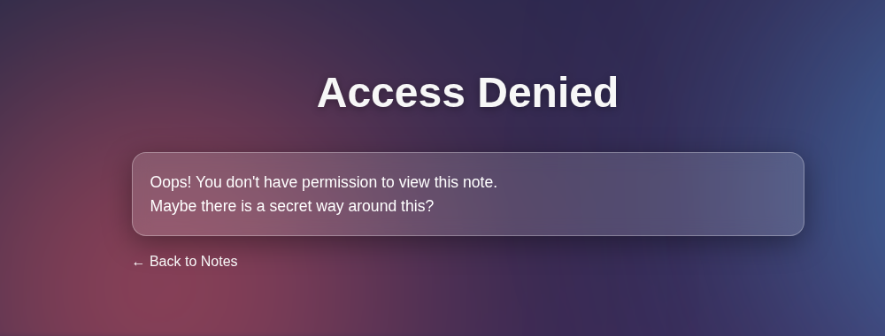
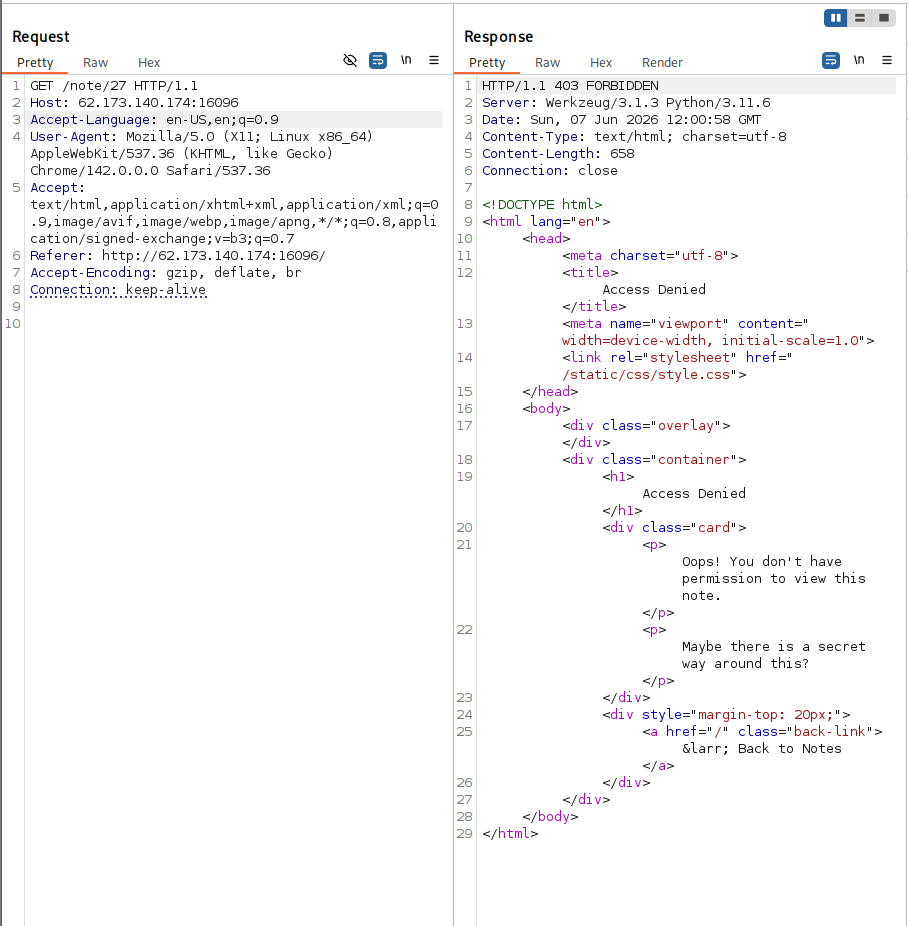
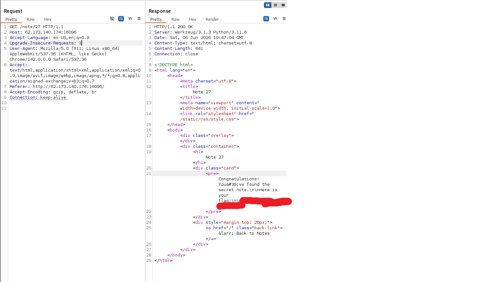

# Write-up_Сервис заметок

Заходим на 27 заметку

Недостаточно прав. Посмотрим запрос в Burp

Проверка не происходит по cookie. Добавим заголовок в запрос. Подменим IP на localhost

> X-Forwarded-For: 127.0.0.1

Вот и флаг
